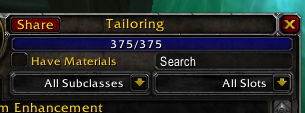
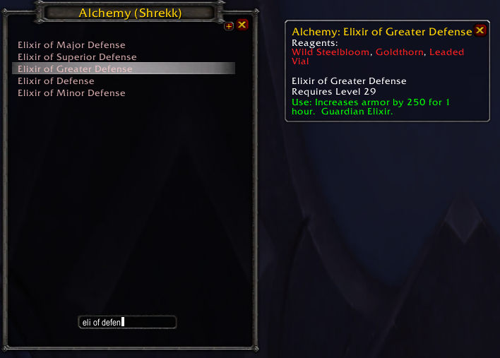

# Gnomeregan Profession Sharer

## About

_Gnomeregan Profession Sharer_ (GPS) allow players to share theirs professions' recipes similarly to how it is implemented in game since `World of Warcraft: Wrath of the Lich King`. It works by allowing player to send prepared in-game link which then allows other players to browse senders' recipes. Both sender and players who want to look through senders' recipes need to have add-on installed.

## Installation

[Download ZIP](https://github.com/MarWit/GPS-TBC/archive/master.zip) and extract it in your `AddOns` folder like you would with any other add-on.

## Usage

Now in each profession's window there will be new button called "Share". After clicking while chat is opened,
it will insert in-game link in format `[Profession :: Sender]`. When some other player will press link, it will display new window with `Senders` recipes. Hovering over recipes' names will show tooltip with it's description. Pressing LMB will keep tooltip opened until player hover over other recipe, while pressing RMB will also disable hovering functionality. Displaying tooltips while hovering can be toggled by `+` button next to the one which closes window. While hovering is disabled you can still click on recipes to show theirs descriptions.

Remember that filtering affects sent recipes!

## Configuration

There is none, just install add-on and it's ready to go!

